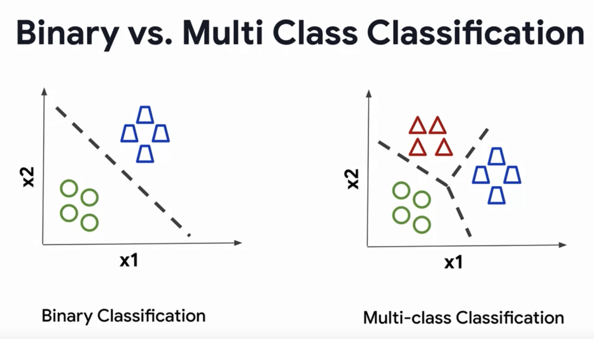

## Notes

---
### Multi Class Classification
* **Multi class** is that you train your network to recognize more than one class. 

---
### Multi Label Classification
* **Multi label** is when you do inference on your image to detect more than one thing in the image.

---
### Object Localization
* **Object Localization** is learning where in the image is the object located. This is typically done with a bounding box around the object within the image.

---
### Object Detection
* Popular Algorithms for Object Detection include:

1. **YOLO (You Only Look Once)**: Known for its speed and accuracy, YOLO models (including YOLOv3, YOLOv4, and YOLOv5) are widely used for real-time object detection.

2. **SSD (Single Shot MultiBox Detector)**: This model is appreciated for its balance between speed and accuracy. It detects objects in images using a single deep neural network.

3. **Faster R-CNN (Region-Based Convolutional Neural Networks)**: Known for its high accuracy, Faster R-CNN improves upon previous versions (R-CNN, Fast R-CNN) by integrating region proposal networks.

4. **RetinaNet**: This model is known for solving the class imbalance problem with its unique focal loss function, offering a good balance of speed and accuracy.

5. **Mask R-CNN**: An extension of Faster R-CNN, this model is used for instance segmentation, identifying the precise pixels of each object in addition to detecting them.

6. **EfficientDet**: This is a scalable and efficient model that optimizes both speed and accuracy. It's based on the EfficientNet architecture and includes a bi-directional feature pyramid network.

7. **CenterNet**: It represents objects as points and regresses to their size, making it simpler and more efficient than bounding-box based approaches.

8. **Anchor-Free Models**: These are a class of models that don’t rely on predefined anchor boxes. Examples include CornerNet and CenterNet.

9. **RCNN (Region-based CNN)** and its variants: Though older, these models laid the groundwork for many modern object detection techniques.

10. **MobileNet + SSD**: This combination is popular for applications on mobile or edge devices due to its lightweight nature.

These models differ in their approach to object detection, speed, accuracy, and computational requirements. The choice of model often depends on the specific needs of the application, such as real-time processing, accuracy, or the ability to run on less powerful hardware.

---
### Image Segmentation

Instead of locating an object within a rectangular bounding box, segmentation instead figures out the pixels that make up that object. 

### Two Types of Image Segmentation
- **Semantic segmentation** -  all objects of the same type form a single classification.
    - Fully Convolutional Neural Networks
    - [UNET](https://lmb.informatik.uni-freiburg.de/people/ronneber/u-net/)
    - DeepLab
- **Instance segmentation** -  even objects of the same type are treated as different objects
    - [Mask R-CNN](https://arxiv.org/abs/1703.06870)

---
